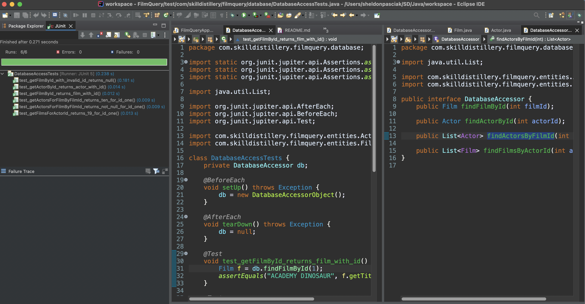

# FilmQueryProject
	
# Film Query Lab and Homework Project!

#### Technologies Used
	- JAVA
	- Eclipse
	- Git/GitHub
	- Sublime Text Editor
	- Zsh
	- MySQL
	- DAO, JDBC
	- JUnit Tests
	
	
#### Lessons Learned
	- Using a shared connection at the DatabaseAccessorObject.
	- Protecting against too many open connections.
	- Need for more abstraction and shared code.
	
#### Notes

JUnit test(s) have been implemented for retrieval and compare the results as if the DB was freshly created and populated with the starting data.  

This means, for actorId = 1, there are 19 films that are retrieved.

```
	@Test
	void test_getFilmsForActorId_returns_19_for_id_one() {
		List<Film> films = db.findFilmsByActorId(1);
		assertEquals(19, films.size());
	}
```

This also means that the results for getting actorId = 2 is as follows.
- id=2
- firstName=Nick
- lastName=Wahlberg

```
	@Test
	void test_getActorById_returns_actor_with_id() {
		Actor a = db.findActorById(2);

		// id=2
		// firstName=Nick
		// lastName=Wahlberg

		assertAll("Actor", () -> assertEquals(2, a.getId()), () -> assertEquals("Nick", a.getFirstName()),
				() -> assertEquals("Wahlberg", a.getLastName()));

	}
```

```
package com.skilldistillery.filmquery.database;

import static org.junit.jupiter.api.Assertions.assertAll;
import static org.junit.jupiter.api.Assertions.assertEquals;
import static org.junit.jupiter.api.Assertions.assertNotNull;
import static org.junit.jupiter.api.Assertions.assertNull;

import java.util.List;

import org.junit.jupiter.api.AfterEach;
import org.junit.jupiter.api.BeforeEach;
import org.junit.jupiter.api.Test;

import com.skilldistillery.filmquery.entities.Actor;
import com.skilldistillery.filmquery.entities.Film;

class DatabaseAccessTests {
	private DatabaseAccessor db;

	@BeforeEach
	void setUp() throws Exception {
		db = new DatabaseAccessorObject();
	}

	@AfterEach
	void tearDown() throws Exception {
		db = null;
	}

	@Test
	void test_getFilmById_returns_film_with_id() {
		Film f = db.findFilmById(1);
		assertEquals("ACADEMY DINOSAUR", f.getTitle());
	}

	@Test
	void test_getFilmById_with_invalid_id_returns_null() {
		Film f = db.findFilmById(-42);
		assertNull(f);
	}

	@Test
	void test_getActorById_returns_actor_with_id() {
		Actor a = db.findActorById(2);

		// id=2
		// firstName=Nick
		// lastName=Wahlberg

		assertAll("Actor", () -> assertEquals(2, a.getId()), () -> assertEquals("Nick", a.getFirstName()),
				() -> assertEquals("Wahlberg", a.getLastName()));

	}

	@Test
	void test_getActorsForFilmByFilmId_returns_not_null_for_id_one() {
		List<Actor> actors = db.findActorsByFilmId(1);
		assertNotNull(actors);
	}

	@Test
	void test_getActorsForFilmByFilmId_returns_ten_for_id_one() {
		List<Actor> actors = db.findActorsByFilmId(1);
		assertEquals(10, actors.size());
	}

	@Test
	void test_getFilmsForActorId_returns_19_for_id_one() {
		List<Film> films = db.findFilmsByActorId(1);
		assertEquals(19, films.size());
	}

}

```



